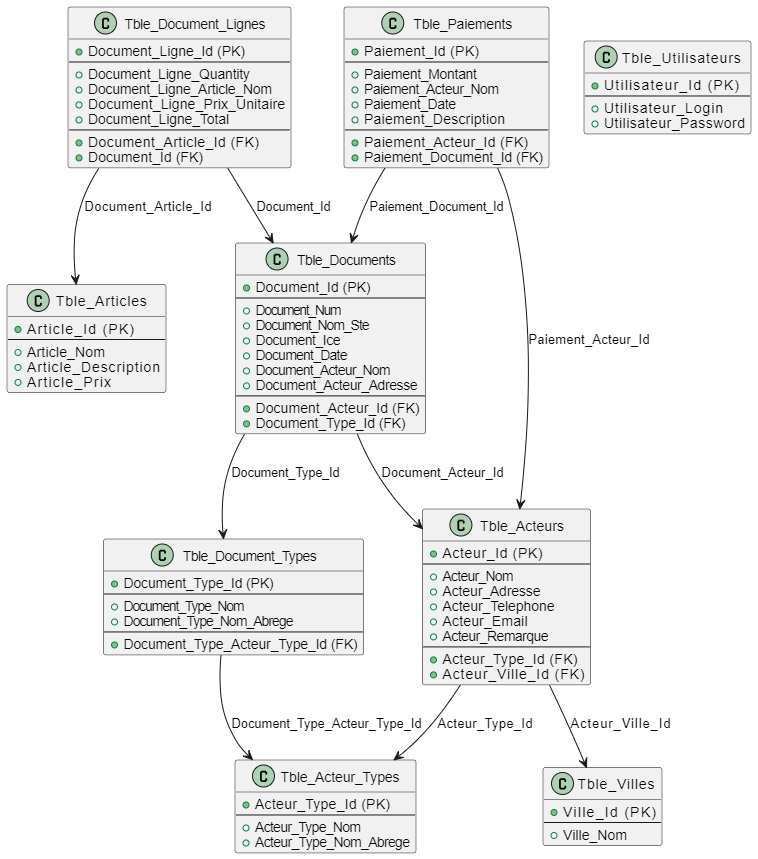

# 💼 GesLune

A Windows-based Point of Sale (POS) and inventory management system built with WPF and .NET 8.

---

## 📂 Project Structure
```text
GesLune/
├── DB Scripts/ # SQL schema & stored procedures
├── GesLune/ # WPF UI and windows (MainWindow, LoginWindow, etc.)
├── GesLune.Sdk/ # Business logic: Models, ViewModels, Repositories
├── images/ # UI assets (icons, etc.)
├── KeyBoards/ # On-screen Arabic and numeric keyboards
├── .env # (Untracked) Local secrets like DB connection strings
├── README.md # You're reading it!
├── CHANGELOG.md # Version history
├── DBDiagram.png # Database schema (ERD)
```

---

## 🚀 Features

- 🔐 User authentication
- 🧾 Sales and invoicing
- 🗃️ Inventory and stock tracking
- 🧑‍💼 Actor/customer management
- 💳 Multiple payment types
- 📈 Reports (chiffre d'affaire, état stock)
- 🖥️ Custom numeric & Arabic on-screen keyboards

---

## 🏗️ Technologies

- C# / WPF (.NET 8)
- MVVM architecture
- SQL Server
- Dapper ORM
- Material Design in XAML

---

## 🛠️ Setup Instructions

### 🔧 Requirements

- [.NET 8 SDK](https://dotnet.microsoft.com/download/dotnet/8.0)
- [SQL Server](https://www.microsoft.com/en-us/sql-server)
- Visual Studio 2022+

### ⚙️ Configuration

1. Create a `.env` file inside `GesLune.Sdk/`:

    ```env
    GESLUNE_DB_CONNECTION=Data Source=localhost;Initial Catalog=GesLune;User ID=sa;Password=YOUR_PASSWORD;TrustServerCertificate=True
    ```

2. Restore NuGet packages:

    ```bash
    dotnet restore
    ```

3. Apply the SQL scripts in `DB Scripts/` to create the database and procedures.

4. Run the solution from `GesLune.sln`.

---

## 🧠 Architecture Overview

- **UI Layer (`GesLune/`)**: All WPF windows (Login, POS, etc.)
- **SDK (`GesLune.Sdk/`)**:
  - `Models/`: DTOs matching DB tables
  - `ViewModels/`: MVVM ViewModel logic
  - `Repositories/`: DB access using Dapper
  - `Commands/`: UI interaction logic (RelayCommand, NavigationCommand)

---

## 🧪 DB Initialization

To initialize the database:

1. Create the database manually (or using `GesLune.Database.sql`).
2. Run all `.sql` scripts in `DB Scripts/`:
   - Tables
   - Views
   - Stored procedures

---

## 🖼️ Database Diagram



---

## 📜 Changelog

See [CHANGELOG.md](./CHANGELOG.md) for version history.

---

## 🛡️ Security Notice

- Never commit `.env` or any credential files.
- Past secrets have been scrubbed from history (see `.gitignore`).
